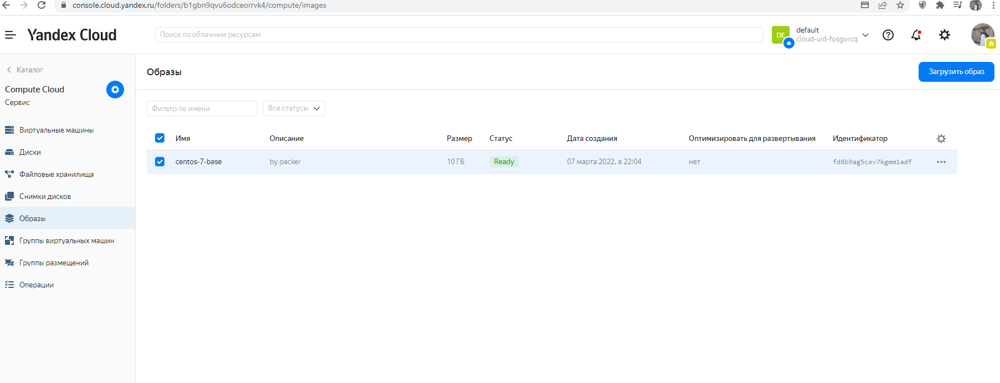
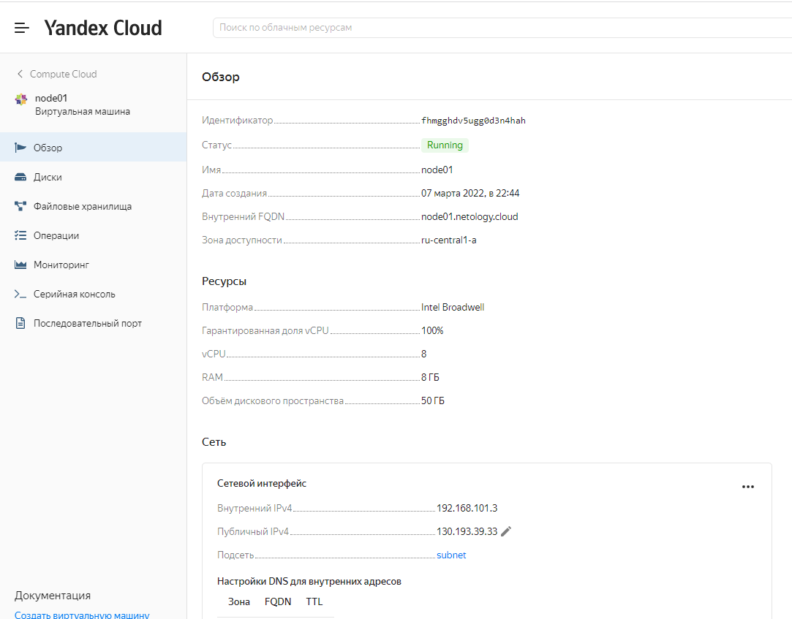
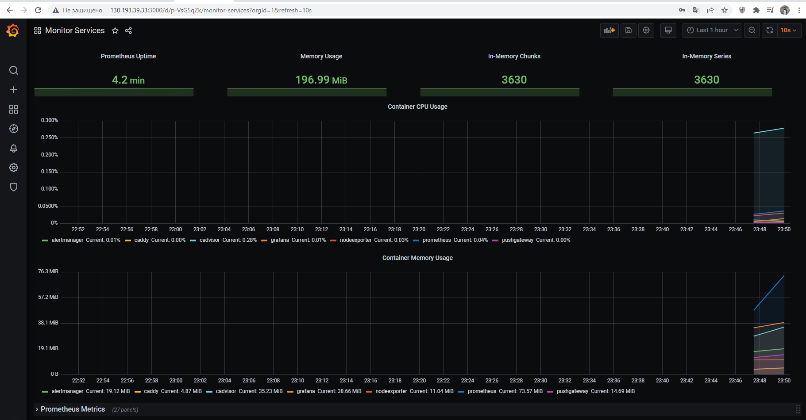

## Задача 1

Создать собственный образ операционной системы с помощью Packer.

Для получения зачета, вам необходимо предоставить:
- Скриншот страницы, как на слайде из презентации (слайд 37).

### Ответ 

###

## Задача 2

Создать вашу первую виртуальную машину в Яндекс.Облаке.

Для получения зачета, вам необходимо предоставить:
- Скриншот страницы свойств созданной ВМ, как на примере ниже:

### Ответ
```bash
yandex_vpc_network.default: Creating...
yandex_vpc_network.default: Creation complete after 2s [id=enpvf6215tlkf94dm4le]
yandex_vpc_subnet.default: Creating...
yandex_vpc_subnet.default: Creation complete after 1s [id=e9b3sc6e1gqcq148bmoa]
yandex_compute_instance.node01: Creating...
yandex_compute_instance.node01: Still creating... [10s elapsed]
yandex_compute_instance.node01: Still creating... [20s elapsed]
yandex_compute_instance.node01: Still creating... [30s elapsed]
yandex_compute_instance.node01: Still creating... [40s elapsed]
yandex_compute_instance.node01: Creation complete after 40s [id=fhmgghdv5ugg0d3n4hah]

Apply complete! Resources: 3 added, 0 changed, 0 destroyed.

Outputs:
external_ip_address_node01_yandex_cloud = "130.193.39.33"
internal_ip_address_node01_yandex_cloud = "192.168.101.3"
```

###

## Задача 3

Создать ваш первый готовый к боевой эксплуатации компонент мониторинга, состоящий из стека микросервисов.

Для получения зачета, вам необходимо предоставить:
- Скриншот работающего веб-интерфейса Grafana с текущими метриками

### Ответ

###


