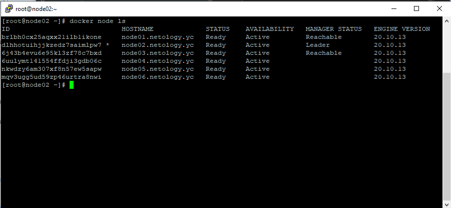
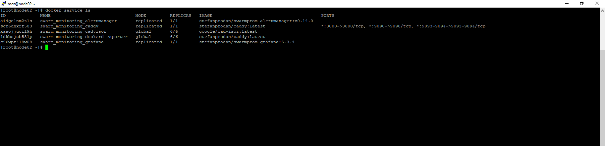

# Домашнее задание к занятию "5.5. Оркестрация кластером Docker контейнеров на примере Docker Swarm"

---

## Задача 1

Дайте письменые ответы на следующие вопросы:

- В чём отличие режимов работы сервисов в Docker Swarm кластере: replication и global?  
``` 
replicated (по умолчанию) - cервисов будет запущено столько, сколько указано при создании (потом можно отмасштабировать). Контейнеры распределяются по кластеру равномерно, учитывая ограничения. 
global — будет запущен ровно один (не более) сервис на каждом узле кластера, учитывая ограничения.
```
- Какой алгоритм выбора лидера используется в Docker Swarm кластере?  
```
В Swarm используется алгоритм консенсуса Raft. 
Для каждого кластера разрешен только один лидер Swarm. Это означает, что если он выйдет из строя, станет временно невозможно разворачивать новые контейнеры в кластере. Существующие контейнеры будут продолжать работать в обычном режиме.
Чтобы обеспечить отказоустойчивость, в кластере должно быть разрешено несколько менеджеров. Одновременно будет работать только один, остальные будут находиться в режиме фолловера. Когда лидер становится недоступным (перестает рассылать heartbeat), фолловеры инициируют выборы нового лидера по специальному алгоритму. 
```
- Что такое Overlay Network?  
```
Внутренняя сеть, которая охватывает все узлы, участвующие в кластере swarm. Эта сеть создается поверх (overlay) хостовой сети, позволяя контейнерам, подключенным к ней, быстро и безопасно обмениваться данными. Docker прозрачно обрабатывает маршрутизацию каждого пакета от и к правильному хосту демона Docker и правильному контейнеру назначения.
```
## Задача 2

Создать ваш первый Docker Swarm кластер в Яндекс.Облаке

Для получения зачета, вам необходимо предоставить скриншот из терминала (консоли), с выводом команды:
```
docker node ls
```


## Задача 3

Создать ваш первый, готовый к боевой эксплуатации кластер мониторинга, состоящий из стека микросервисов.

Для получения зачета, вам необходимо предоставить скриншот из терминала (консоли), с выводом команды:
```
docker service ls
```


