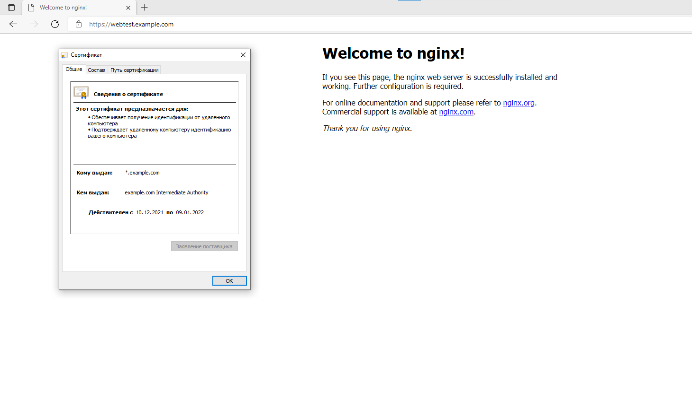
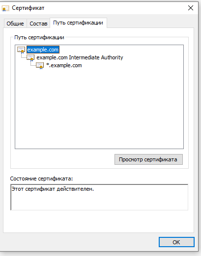

# Курсовая работа по итогам модуля "DevOps и системное администрирование"

Курсовая работа необходима для проверки практических навыков, полученных в ходе прохождения курса "DevOps и системное администрирование".

Мы создадим и настроим виртуальное рабочее место. Позже вы сможете использовать эту систему для выполнения домашних заданий по курсу

## Задание

1. Создайте виртуальную машину Linux.  
Создал виртуальную машину в Oracle Cloud, чтобы потом использовать эту машину при дальнейшем обучении и опытах.

2. Установите ufw и разрешите к этой машине сессии на порты 22 и 443, при этом трафик на интерфейсе localhost (lo) должен ходить свободно на все порты.  
Уже стоит в шаблоне, но по умолчанию включен iptables , отключил его и настроил ufw
```bash
root@vault:~# ufw status verbose
Status: active
Logging: on (low)
Default: deny (incoming), allow (outgoing), disabled (routed)
New profiles: skip

To                         Action      From
--                         ------      ----
22                         ALLOW IN    Anywhere
443                        ALLOW IN    Anywhere
22 (v6)                    ALLOW IN    Anywhere (v6)
443 (v6)                   ALLOW IN    Anywhere (v6)
```

3. Установите hashicorp vault ([инструкция по ссылке](https://learn.hashicorp.com/tutorials/vault/getting-started-install?in=vault/getting-started#install-vault)).
```bash
ubuntu@courseworkbox$ curl -fsSL https://apt.releases.hashicorp.com/gpg | sudo apt-key add -
OK
ubuntu@courseworkbox$ sudo apt-add-repository "deb [arch=amd64] https://apt.releases.hashicorp.com $(lsb_release -cs) main"
Get:1 https://apt.releases.hashicorp.com focal InRelease [9495 B]
Hit:2 http://eu-frankfurt-1-ad-3.clouds.archive.ubuntu.com/ubuntu focal InReleas                                                                                                                                                             e
Hit:3 http://security.ubuntu.com/ubuntu focal-security InRelease
Hit:4 http://eu-frankfurt-1-ad-3.clouds.archive.ubuntu.com/ubuntu focal-updates                                                                                                                                                              InRelease
Hit:5 http://eu-frankfurt-1-ad-3.clouds.archive.ubuntu.com/ubuntu focal-backport                                                                                                                                                             s InRelease
Get:6 https://apt.releases.hashicorp.com focal/main amd64 Packages [37.8 kB]
Fetched 37.8 kB in 1s (34.0 kB/s)
Reading package lists... Done
ubuntu@courseworkbox$ sudo apt install vault                                                                                                                                                                                      Reading package lists... Done
Building dependency tree
Reading state information... Done
The following NEW packages will be installed:
  vault
0 upgraded, 1 newly installed, 0 to remove and 41 not upgraded.
Need to get 69.3 MB of archives.
After this operation, 187 MB of additional disk space will be used.
Get:1 https://apt.releases.hashicorp.com focal/main amd64 vault amd64 1.9.0 [69.                                                                                                                                                             3 MB]
Fetched 69.3 MB in 14s (4793 kB/s)
Selecting previously unselected package vault.
(Reading database ... 70119 files and directories currently installed.)
Preparing to unpack .../archives/vault_1.9.0_amd64.deb ...
Unpacking vault (1.9.0) ...
Setting up vault (1.9.0) ...
Generating Vault TLS key and self-signed certificate...
Generating a RSA private key
........++++
................................................................................                                                                                                                                                             ...............................................++++
writing new private key to 'tls.key'
-----
Vault TLS key and self-signed certificate have been generated in '/opt/vault/tls                                                                                                                                                             '.
```

4. Cоздайте центр сертификации по инструкции ([ссылка](https://learn.hashicorp.com/tutorials/vault/pki-engine?in=vault/secrets-management)) и выпустите сертификат для использования его в настройке веб-сервера nginx (срок жизни сертификата - месяц).    

Далее решил усложнить и не запусать Vault в деморежиме как в инструкции  
пришлось сгенерировать сертефикаты для его listner т.к при подключению к vault выдавалась ошибка отсутсвия SAN в сертификате листнера
```bash
x509 cannot validate certificate for 127.0.0.1 because it doesn't contain any ip sans 
```
```bash
openssl req -x509 -sha256 -nodes -days 365 -newkey rsa:2048 -keyout tls.key -out tls.crt  -config req.conf
где req.conf
[req]
distinguished_name = req_distinguished_name
x509_extensions = v3_req
prompt = no
[req_distinguished_name]
C = RU
ST = M
L = Moscow
O = DevOpsStudy
OU = IT
CN = Vault
[v3_req]
keyUsage = keyEncipherment, dataEncipherment
extendedKeyUsage = serverAuth
subjectAltName = @alt_names
[alt_names]
DNS.1 = localhost
DNS.2 = courseworkbox
DNS.3 = coureseworkbox.example.com
```
После положил открытый ключ в /usr/local/share/ca-certificates/extra/
И сделал т.к ругался на недоверенный сертификат
```bash
sudo update-ca-certificates
И
export VAULT_ADDR=http://localhost:8200 , т.к на подключение по IP тоже ругался
```
```bash
ubuntu@vault:~$ vault operator init
Получил ключи для "распечатования"
ubuntu@vault:~$ vault operator unseal - раза с вводом 3 ключей
Инициализировал
ubuntu@vault:~$ vault status
Key             Value
---             -----
Seal Type       shamir
Initialized     true
Sealed          false
Total Shares    5
Threshold       3
Version         1.9.0
Storage Type    file
Cluster Name    vault-cluster-28ed6404
Cluster ID      1d6645a8-1364-7b3f-bb5f-b023af16816d
HA Enabled      false
ubuntu@vault:~$
```
Создал корневой сертификат
```bash
vault secrets enable     -path=pki_root_ca     -description="PKI Root CA"     -max-lease-ttl="262800h"     pki
```
Выгрузил его и указал url CA и списка отозванных
```bash
vault write -field=certificate pki/root/generate/internal common_name="example.com" ttl=87600h > CA_cert.crt
vault write pki/config/urls      issuing_certificates="$VAULT_ADDR/v1/pki/ca"      crl_distribution_points="$VAULT_ADDR/v1/pki/crl"
```
Выпустил промежуточный и роль для выпуска сертификатов
```bash
vault write -format=json pki_int/intermediate/generate/internal      common_name="example.com Intermediate Authority"      | jq -r '.data.csr' > pki_intermediate.csr
vault write -format=json pki/root/sign-intermediate csr=@pki_intermediate.csr      format=pem_bundle ttl="43800h"      | jq -r '.data.certificate' > intermediate.cert.pem
vault write pki_int/intermediate/set-signed certificate=@intermediate.cert.pem
vault write pki_int/roles/example-dot-com \
     allowed_domains="example.com" \
     allow_subdomains=true \
     max_ttl="720h"
```
Выпустил сертификат для сервера
```commandline
  256  vault write -format=json pki_int/issue/example-dot-com common_name="*.example.com" ttl="720h" > wildcard_example.com.json
  257  cat wildcard_example.com.json | jq -r '.data.private_key' > wildcard_example.pem
  258  cat wildcard_example.com.json | jq -r '.data.certificate' > wildcard_example.cer
  259  cat wildcard_example.com.json | jq -r '.data.ca_chain[]' >> wildcard_example.cer
```

5. Установите корневой сертификат созданного центра сертификации в доверенные в хостовой системе.
```bash
ubuntu@vault:~$ sudo cp CA_cert.crt /usr/local/share/ca-certificates/extra/
ubuntu@vault:~$ sudo update-ca-certificates
Updating certificates in /etc/ssl/certs...
1 added, 0 removed; done.
Running hooks in /etc/ca-certificates/update.d...
done.
```
6. Установите nginx.
По инструкции ([ссылка](https://nginx.org/en/docs/http/configuring_https_servers.html)) настройте nginx на https, используя ранее подготовленный сертификат:
  - можно использовать стандартную стартовую страницу nginx для демонстрации работы сервера;
  - можно использовать и другой html файл, сделанный вами;
```bash
ubuntu@vault:/usr/share$ curl https://nginx.org/keys/nginx_signing.key | gpg --d                                                                                                                                                             earmor \
>     | sudo tee /usr/share/keyrings/nginx-archive-keyring.gpg >/dev/null
  % Total    % Received % Xferd  Average Speed   Time    Time     Time  Current
                                 Dload  Upload   Total   Spent    Left  Speed
100  1561  100  1561    0     0   6244      0 --:--:-- --:--:-- --:--:--  6244
ubuntu@vault:/usr/share$ sudo gpg --dry-run --quiet --import --import-options im                                                                                                                                                             port-show /usr/share/keyrings/nginx-archive-keyring.gpg
gpg: keyblock resource '/root/.gnupg/pubring.kbx': No such file or directory
pub   rsa2048 2011-08-19 [SC] [expires: 2024-06-14]
      573BFD6B3D8FBC641079A6ABABF5BD827BD9BF62
uid                      nginx signing key <signing-key@nginx.com>

ubuntu@vault:/usr/share$ echo "deb [signed-by=/usr/share/keyrings/nginx-archive-                                                                                                                                                             keyring.gpg] \
> http://nginx.org/packages/ubuntu `lsb_release -cs` nginx" \
>     | sudo tee /etc/apt/sources.list.d/nginx.list
deb [signed-by=/usr/share/keyrings/nginx-archive-keyring.gpg] http://nginx.org/p                                                                                                                                                             ackages/ubuntu focal nginx
ubuntu@vault:/usr/share$ sudo apt update
Get:1 http://nginx.org/packages/ubuntu focal InRelease [2849 B]
Hit:2 http://eu-frankfurt-1-ad-3.clouds.archive.ubuntu.com/ubuntu focal InReleas                                                                                                                                                             e
Get:3 http://eu-frankfurt-1-ad-3.clouds.archive.ubuntu.com/ubuntu focal-updates                                                                                                                                                              InRelease [114 kB]
Get:4 http://security.ubuntu.com/ubuntu focal-security InRelease [114 kB]
Get:5 https://apt.releases.hashicorp.com focal InRelease [9495 B]
Get:6 http://nginx.org/packages/ubuntu focal/nginx amd64 Packages [15.0 kB]
Get:7 http://eu-frankfurt-1-ad-3.clouds.archive.ubuntu.com/ubuntu focal-backport                                                                                                                                                             s InRelease [108 kB]
Get:8 https://apt.releases.hashicorp.com focal/main amd64 Packages [38.7 kB]
Get:9 http://eu-frankfurt-1-ad-3.clouds.archive.ubuntu.com/ubuntu focal-updates/                                                                                                                                                             main amd64 Packages [1393 kB]
Get:10 http://eu-frankfurt-1-ad-3.clouds.archive.ubuntu.com/ubuntu focal-updates                                                                                                                                                             /universe amd64 Packages [881 kB]
Fetched 2675 kB in 2s (1215 kB/s)
Reading package lists... Done
Building dependency tree
Reading state information... Done
20 packages can be upgraded. Run 'apt list --upgradable' to see them.
ubuntu@vault:/usr/share$ sudo apt install nginx
Reading package lists... Done
Building dependency tree
Reading state information... Done
The following NEW packages will be installed:
  nginx
0 upgraded, 1 newly installed, 0 to remove and 20 not upgraded.
Need to get 879 kB of archives.
After this operation, 3117 kB of additional disk space will be used.
Get:1 http://nginx.org/packages/ubuntu focal/nginx amd64 nginx amd64 1.20.2-1~fo                                                                                                                                                             cal [879 kB]
Fetched 879 kB in 0s (4499 kB/s)
Selecting previously unselected package nginx.
(Reading database ... 108011 files and directories currently installed.)
Preparing to unpack .../nginx_1.20.2-1~focal_amd64.deb ...
----------------------------------------------------------------------

Thanks for using nginx!

Please find the official documentation for nginx here:
* https://nginx.org/en/docs/

Please subscribe to nginx-announce mailing list to get
the most important news about nginx:
* https://nginx.org/en/support.html

Commercial subscriptions for nginx are available on:
* https://nginx.com/products/

----------------------------------------------------------------------
Unpacking nginx (1.20.2-1~focal) ...
Setting up nginx (1.20.2-1~focal) ...
Created symlink /etc/systemd/system/multi-user.target.wants/nginx.service → /lib                                                                                                                                                             /systemd/system/nginx.service.
Processing triggers for man-db (2.9.1-1) ...
Processing triggers for systemd (245.4-4ubuntu3.13) ...
ubuntu@vault:$
```
Добавил в конфиг:
```bash
server {
    listen       443 ssl;
    server_name  webtest.example.com;
    ssl_certificate /etc/nginx/ssl/wildcard_example.cer;
    ssl_certificate_key /etc/nginx/ssl/wildcard_example.pem;
    access_log  /var/log/nginx/host.access.log  main;
```
8. Откройте в браузере на хосте https адрес страницы, которую обслуживает сервер nginx.  
т.к виртуалка находится в облаке добавил себе на локальную машину dns имя webtest.example.com в файл hosts 
и добавил себе корневой сертификат в доверенные

Цепочка

9. Создайте скрипт, который будет генерировать новый сертификат в vault:
  - генерируем новый сертификат так, чтобы не переписывать конфиг nginx;
  - перезапускаем nginx для применения нового сертификата.
```bash
#!/bin/bash
export VAULT_ADDR='https://localhost:8200'
export VAULT_TOKEN='token'
CERT_NAME='/etc/nginx/ssl/wildcard_example.cer'
KEY_NAME='/etc/nginx/ssl/wildcard_example.pem'
JSON_NAME='/tmp/wildcard_example.com.json'
VAULT_EXEC='vault write -format=json pki_int/issue/example-dot-com common_name=*.example.com ttl=720h'

enroll_ssl () {
    ${VAULT_EXEC}>${JSON_NAME}
    if [ ! -s $JSON_NAME ]; then   #Если файл пустой то выходим, лучше просроченный сертификат чем никакой
        echo "Error"
        exit 0
    else
    echo "Enroll ssl certificate..."
    fi
    }
parse_json() {
  cat ${JSON_NAME} | jq -r '.data.private_key' > ${KEY_NAME}
  cat ${JSON_NAME} | jq -r '.data.certificate' > ${CERT_NAME}
  cat ${JSON_NAME} | jq -r '.data.ca_chain[]' >> ${CERT_NAME}
  rm ${JSON_NAME}
}
enroll_ssl
parse_json
sleep 2
systemctl restart nginx
```
10. Поместите скрипт в crontab, чтобы сертификат обновлялся какого-то числа каждого месяца в удобное для вас время.  
Проверил сначала будет ли запускаться из под cron запуская его каждые 30 мин, сработало, поправил на удобное время:
```bash
root@vault:~# crontab -l
30 5 5,26 * * /root/autoenroll.sh # в 5:30 утра каждого 5 и 26ого числа, т.к сертификат на 30 дней чтобы не попасть на месяц в 31 день 
```