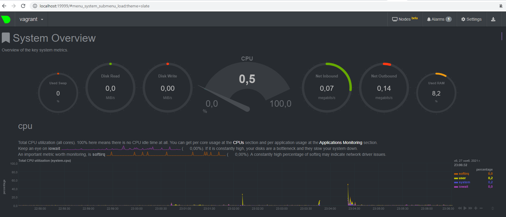

# Домашнее задание к занятию "3.4. Операционные системы, лекция 2"

1. На лекции мы познакомились с [node_exporter](https://github.com/prometheus/node_exporter/releases). В демонстрации его исполняемый файл запускался в background. Этого достаточно для демо, но не для настоящей production-системы, где процессы должны находиться под внешним управлением. Используя знания из лекции по systemd, создайте самостоятельно простой [unit-файл](https://www.freedesktop.org/software/systemd/man/systemd.service.html) для node_exporter:

    * поместите его в автозагрузку,
    * предусмотрите возможность добавления опций к запускаемому процессу через внешний файл (посмотрите, например, на `systemctl cat cron`),
    * удостоверьтесь, что с помощью systemctl процесс корректно стартует, завершается, а после перезагрузки автоматически поднимается.
```bash
vagrant@vagrant:~$ systemctl cat node_exporter
# /etc/systemd/system/node_exporter.service
[Unit]
Description=Node Exporter

[Service]
ExecStart=/usr/local/bin/node_exporter
EnvironmentFile=/etc/node_exporter.params

[Install]
WantedBy=multi-user.target
```

```bash
vagrant@vagrant:~$ sudo systemctl status node_exporter
● node_exporter.service - Node Exporter
     Loaded: loaded (/etc/systemd/system/node_exporter.service; enabled; vendor preset: enabled)
     Active: active (running) since Sat 2021-11-27 19:14:24 UTC; 2min 22s ago
   Main PID: 623 (node_exporter)
      Tasks: 6 (limit: 2278)
     Memory: 17.7M
     CGroup: /system.slice/node_exporter.service
             └─623 /opt/node_exporter/node_exporter

Nov 27 19:14:25 vagrant node_exporter[623]: ts=2021-11-27T19:14:25.106Z caller=node_exporter.go:115 level=info collector=thermal_zone
Nov 27 19:14:25 vagrant node_exporter[623]: ts=2021-11-27T19:14:25.106Z caller=node_exporter.go:115 level=info collector=time
Nov 27 19:14:25 vagrant node_exporter[623]: ts=2021-11-27T19:14:25.106Z caller=node_exporter.go:115 level=info collector=timex
Nov 27 19:14:25 vagrant node_exporter[623]: ts=2021-11-27T19:14:25.106Z caller=node_exporter.go:115 level=info collector=udp_queues
Nov 27 19:14:25 vagrant node_exporter[623]: ts=2021-11-27T19:14:25.106Z caller=node_exporter.go:115 level=info collector=uname
Nov 27 19:14:25 vagrant node_exporter[623]: ts=2021-11-27T19:14:25.106Z caller=node_exporter.go:115 level=info collector=vmstat
Nov 27 19:14:25 vagrant node_exporter[623]: ts=2021-11-27T19:14:25.106Z caller=node_exporter.go:115 level=info collector=xfs
Nov 27 19:14:25 vagrant node_exporter[623]: ts=2021-11-27T19:14:25.106Z caller=node_exporter.go:115 level=info collector=zfs
Nov 27 19:14:25 vagrant node_exporter[623]: ts=2021-11-27T19:14:25.106Z caller=node_exporter.go:199 level=info msg="Listening on" address=:9100
Nov 27 19:14:25 vagrant node_exporter[623]: ts=2021-11-27T19:14:25.107Z caller=tls_config.go:195 level=info msg="TLS is disabled." http2=false
```

```bash
vagrant@vagrant:~$ sudo systemctl stop node_exporter
vagrant@vagrant:~$ ps -A | grep node_exporter
vagrant@vagrant:~$ sudo systemctl start node_exporter
vagrant@vagrant:~$ ps -A | grep node_exporter
   1670 ?        00:00:00 node_exporter
```
2. Ознакомьтесь с опциями node_exporter и выводом `/metrics` по-умолчанию. Приведите несколько опций, которые вы бы выбрали для базового мониторинга хоста по CPU, памяти, диску и сети.
```bash
node_cpu_seconds_total{cpu="0",mode="idle"} 17.27
node_cpu_seconds_total{cpu="0",mode="system"} 1.02
node_cpu_seconds_total{cpu="0",mode="user"} 1
node_memory_MemAvailable_bytes 1.774882816e+09
node_memory_MemFree_bytes 1.671135232e+09
node_memory_MemTotal_bytes 2.0836352e+09
node_disk_io_time_seconds_total{device="dm-0"}
node_disk_read_time_seconds_total{device="dm-0"}
node_disk_write_time_seconds_total{device="dm-0"}
node_network_receive_packets_total{device="eth0"} 573
node_network_transmit_bytes_total{device="eth0"} 75908
node_network_transmit_errs_total{device="eth0"} 0
```
3. Установите в свою виртуальную машину [Netdata](https://github.com/netdata/netdata). Воспользуйтесь [готовыми пакетами](https://packagecloud.io/netdata/netdata/install) для установки (`sudo apt install -y netdata`). После успешной установки:
    * в конфигурационном файле `/etc/netdata/netdata.conf` в секции [web] замените значение с localhost на `bind to = 0.0.0.0`,
    * добавьте в Vagrantfile проброс порта Netdata на свой локальный компьютер и сделайте `vagrant reload`:

    ```bash
    config.vm.network "forwarded_port", guest: 19999, host: 19999
    ```

    После успешной перезагрузки в браузере *на своем ПК* (не в виртуальной машине) вы должны суметь зайти на `localhost:19999`. Ознакомьтесь с метриками, которые по умолчанию собираются Netdata и с комментариями, которые даны к этим метрикам.

4. Можно ли по выводу `dmesg` понять, осознает ли ОС, что загружена не на настоящем оборудовании, а на системе виртуализации?  
Ответ:
Да.
```bash
[    0.000000] DMI: innotek GmbH VirtualBox/VirtualBox, BIOS VirtualBox 12/01/2006
[    0.000000] Hypervisor detected: KVM
```

5. Как настроен sysctl `fs.nr_open` на системе по-умолчанию? Узнайте, что означает этот параметр. Какой другой существующий лимит не позволит достичь такого числа (`ulimit --help`)?  
```bash
vagrant@vagrant:~$ cat /proc/sys/fs/nr_open
1048576 - Лимит на количество открытых дескрипторов
```
```bash
vagrant@vagrant:~$ ulimit -Hn -- жесткий лимит на пользователя
1048576
vagrant@vagrant:~$ ulimit -Sn -- мягий лимит на пользователя (можно увеличить в пределах жесткого лимита )
1024
```

6. Запустите любой долгоживущий процесс (не `ls`, который отработает мгновенно, а, например, `sleep 1h`) в отдельном неймспейсе процессов; покажите, что ваш процесс работает под PID 1 через `nsenter`. Для простоты работайте в данном задании под root (`sudo -i`). Под обычным пользователем требуются дополнительные опции (`--map-root-user`) и т.д.
```bash 
 root@vagrant:/# ps
    PID TTY          TIME CMD
 114492 pts/0    00:00:00 sudo
 114493 pts/0    00:00:00 bash
 114502 pts/0    00:00:00 bash
 114530 pts/0    00:00:00 nsenter
 114531 pts/0    00:00:00 bash
 114688 pts/0    00:00:00 sleep
 114836 pts/0    00:00:00 ps
root@vagrant:/# nsenter --target 114688 --pid --mount
root@vagrant:/# ps
    PID TTY          TIME CMD
      1 pts/0    00:00:00 sleep
      2 pts/0    00:00:00 bash
     11 pts/0    00:00:00 ps
root@vagrant:/#
```
7. Найдите информацию о том, что такое `:(){ :|:& };:`. Запустите эту команду в своей виртуальной машине Vagrant с Ubuntu 20.04 (**это важно, поведение в других ОС не проверялось**). Некоторое время все будет "плохо", после чего (минуты) – ОС должна стабилизироваться. Вызов `dmesg` расскажет, какой механизм помог автоматической стабилизации. Как настроен этот механизм по-умолчанию, и как изменить число процессов, которое можно создать в сессии?  

Это функция ( двоеточие  для того чтобы визуально было запутанее)
```bash
func () {
  func | func &
}
func
```
 которая параллельно пускает два своих экземпляра. Каждый пускает ещё по два и т.д. 
При отсутствии лимита на число процессов машина быстро исчерпывает физическую память и уходит в своп.
```bash
[Sat Nov 27 20:09:48 2021] cgroup: fork rejected by pids controller in /user.slice/user-1000.slice/session-4.scope
```
По умолчанию на пользователя установлено 
```bash
root@vagrant:/# ulimit -Su
7595
```
При необходимости можно изменить через ulimit -u до необходимого значения