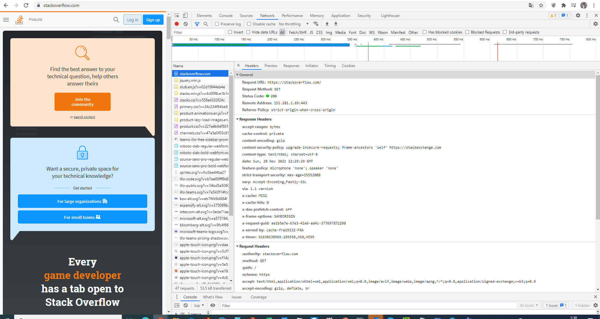

# Домашнее задание к занятию "3.6. Компьютерные сети, лекция 1"

1. Работа c HTTP через телнет.
- Подключитесь утилитой телнет к сайту stackoverflow.com
`telnet stackoverflow.com 80`
- отправьте HTTP запрос
```bash
GET /questions HTTP/1.0
HOST: stackoverflow.com
[press enter]
[press enter]
```
- В ответе укажите полученный HTTP код, что он означает?
```bash
vagrant@vagrant:/tmp/new$ telnet stackoverflow.com 80
Trying 151.101.193.69...
Connected to stackoverflow.com.
Escape character is '^]'.
GET /question HTTP/1.0
HOST: stackoverflow.com

HTTP/1.1 301 Moved Permanently
```
301 - стандартный код ответа HTTP, получаемый в ответ от сервера в ситуации, когда запрошенный ресурс был на постоянной основе перемещён в новое месторасположение, и указывающий на то, что текущие ссылки, использующие данный URL, должны быть обновлены

2. Повторите задание 1 в браузере, используя консоль разработчика F12.
- откройте вкладку `Network`
- отправьте запрос http://stackoverflow.com
- найдите первый ответ HTTP сервера, откройте вкладку `Headers`
- укажите в ответе полученный HTTP код.
- проверьте время загрузки страницы, какой запрос обрабатывался дольше всего?
- приложите скриншот консоли браузера в ответ.  

HTTP код - 200  
Самый долгий запрос 

Скриншот консоли

3. Какой IP адрес у вас в интернете?
```bash
vagrant@vagrant:~$ curl ifconfig.me
46.138.198.200
vagrant@vagrant:~$
```
4. Какому провайдеру принадлежит ваш IP адрес? Какой автономной системе AS? Воспользуйтесь утилитой `whois`
```bash
route:          46.138.0.0/16
descr:          Moscow Local Telephone Network (PJSC MGTS)
descr:          Moscow, Russia
origin:         AS25513
```
5. Через какие сети проходит пакет, отправленный с вашего компьютера на адрес 8.8.8.8? Через какие AS? Воспользуйтесь утилитой `traceroute`
```bash
vagrant@vagrant:~$ traceroute -AnI 8.8.8.8
traceroute to 8.8.8.8 (8.8.8.8), 30 hops max, 60 byte packets
 1  10.0.2.2 [*]  0.181 ms  0.161 ms  0.153 ms
 2  192.168.1.254 [*]  2.861 ms  2.978 ms  2.971 ms
 3  10.131.128.1 [*]  5.964 ms  7.338 ms  7.533 ms
 4  212.188.1.106 [AS8359]  6.807 ms  6.911 ms  7.232 ms
 5  212.188.1.105 [AS8359]  8.511 ms  8.857 ms  8.944 ms
 6  212.188.56.13 [AS8359]  9.358 ms  12.924 ms  12.742 ms
 7  195.34.50.74 [AS8359]  12.607 ms  8.722 ms  12.780 ms
 8  212.188.29.82 [AS8359]  12.805 ms  12.940 ms  13.087 ms
 9  * * *
10  142.251.49.158 [AS15169]  25.241 ms * *
11  108.170.235.204 [AS15169]  27.059 ms  27.457 ms  22.997 ms
12  172.253.79.115 [AS15169]  20.206 ms  20.197 ms  21.046 ms
13  * * *
14  * * *
15  * * *
16  * * *
17  * * *
18  * * *
19  * * *
20  * * *
21  * * *
22  8.8.8.8 [AS15169]  23.479 ms  24.038 ms  21.675 ms
```
6. Повторите задание 5 в утилите `mtr`. На каком участке наибольшая задержка - delay?
```bash
vagrant@vagrant:~$ mtr -nz 8.8.8.8
agrant (10.0.2.15)                                                                                    2021-11-28T22:09:04+0000
Pings  Help   Display mode   Restart statistics   Order of fields   quit
 Host                                                                                  Packets               Pings
 Host                                                                                Loss%   Snt   Last   Avg  Best  Wrst StDev
 1. AS???    10.0.2.2                                                                 0.0%    15    0.3   0.3   0.3   0.4   0.1
 2. AS???    192.168.1.254                                                            0.0%    15    2.2   2.4   1.5   4.5   0.9
 3. AS???    10.131.128.1                                                             6.7%    15    8.0   6.5   4.6  10.1   1.7
 4. AS8359   212.188.1.106                                                            0.0%    15   41.4  11.3   4.9  41.5  12.3
 5. AS8359   212.188.1.105                                                            0.0%    15    6.4   7.1   6.0  10.9   1.4
 6. AS8359   212.188.56.13                                                            0.0%    15    6.8   9.3   6.4  19.2   3.7
 7. AS8359   195.34.50.74                                                             0.0%    15    8.8   7.4   6.0  10.4   1.2
 8. AS8359   212.188.29.82                                                            0.0%    15    6.3  10.0   6.0  53.1  12.0
 9. AS15169  108.170.250.51                                                          78.6%    15    7.8   9.9   7.3  14.6   4.1
10. AS15169  142.251.49.158                                                          33.3%    15   21.5  23.0  21.0  26.6   2.0
11. AS15169  108.170.235.204                                                          0.0%    15   24.2  25.2  22.4  31.0   2.5
12. AS15169  172.253.79.115                                                           0.0%    15   19.6  21.5  19.0  25.4   1.9
13. (waiting for reply)
14. (waiting for reply)
15. (waiting for reply)
16. (waiting for reply)
17. (waiting for reply)
18. (waiting for reply)
19. (waiting for reply)
20. (waiting for reply)
21. (waiting for reply)
22. AS15169  8.8.8.8                                                                  0.0%    14   21.2  21.7  18.5  31.9   3.2
```
Задержка больше всего на узле 108.170.235.204

7. Какие DNS сервера отвечают за доменное имя dns.google? Какие A записи? воспользуйтесь утилитой `dig`  
ns1.zdns.google, ns2.zdns.google,ns3.zdns.google,ns4.zdns.google
```bash
agrant@vagrant:~$ dig dns.google ns

; <<>> DiG 9.16.1-Ubuntu <<>> dns.google ns
;; global options: +cmd
;; Got answer:
;; ->>HEADER<<- opcode: QUERY, status: NOERROR, id: 17733
;; flags: qr rd ra ad; QUERY: 1, ANSWER: 4, AUTHORITY: 0, ADDITIONAL: 1

;; OPT PSEUDOSECTION:
; EDNS: version: 0, flags:; udp: 512
;; QUESTION SECTION:
;dns.google.                    IN      NS

;; ANSWER SECTION:
dns.google.             16668   IN      NS      ns2.zdns.google.
dns.google.             16668   IN      NS      ns1.zdns.google.
dns.google.             16668   IN      NS      ns3.zdns.google.
dns.google.             16668   IN      NS      ns4.zdns.google.

;; Query time: 23 msec
;; SERVER: 8.8.8.8#53(8.8.8.8)
;; WHEN: Sun Nov 28 22:13:30 UTC 2021
;; MSG SIZE  rcvd: 116
```
```bash
dns.google.             714     IN      A       8.8.4.4
dns.google.             714     IN      A       8.8.8.8
```
8. Проверьте PTR записи для IP адресов из задания 7. Какое доменное имя привязано к IP? воспользуйтесь утилитой `dig`  
PTR - dns.google
```bash
vagrant@vagrant:~$ dig -x 8.8.8.8

; <<>> DiG 9.16.1-Ubuntu <<>> -x 8.8.8.8
;; global options: +cmd
;; Got answer:
;; ->>HEADER<<- opcode: QUERY, status: NOERROR, id: 38362
;; flags: qr rd ra; QUERY: 1, ANSWER: 1, AUTHORITY: 0, ADDITIONAL: 1

;; OPT PSEUDOSECTION:
; EDNS: version: 0, flags:; udp: 512
;; QUESTION SECTION:
;8.8.8.8.in-addr.arpa.          IN      PTR

;; ANSWER SECTION:
8.8.8.8.in-addr.arpa.   17972   IN      PTR     dns.google.

;; Query time: 20 msec
;; SERVER: 8.8.8.8#53(8.8.8.8)
;; WHEN: Sun Nov 28 22:19:22 UTC 2021
;; MSG SIZE  rcvd: 73

vagrant@vagrant:~$ dig -x 8.8.4.4

; <<>> DiG 9.16.1-Ubuntu <<>> -x 8.8.4.4
;; global options: +cmd
;; Got answer:
;; ->>HEADER<<- opcode: QUERY, status: NOERROR, id: 27801
;; flags: qr rd ra; QUERY: 1, ANSWER: 1, AUTHORITY: 0, ADDITIONAL: 1

;; OPT PSEUDOSECTION:
; EDNS: version: 0, flags:; udp: 512
;; QUESTION SECTION:
;4.4.8.8.in-addr.arpa.          IN      PTR

;; ANSWER SECTION:
4.4.8.8.in-addr.arpa.   18900   IN      PTR     dns.google.

;; Query time: 20 msec
;; SERVER: 8.8.8.8#53(8.8.8.8)
;; WHEN: Sun Nov 28 22:19:32 UTC 2021
;; MSG SIZE  rcvd: 73

vagrant@vagrant:~$
```
В качестве ответов на вопросы можно приложите лог выполнения команд в консоли или скриншот полученных результатов.