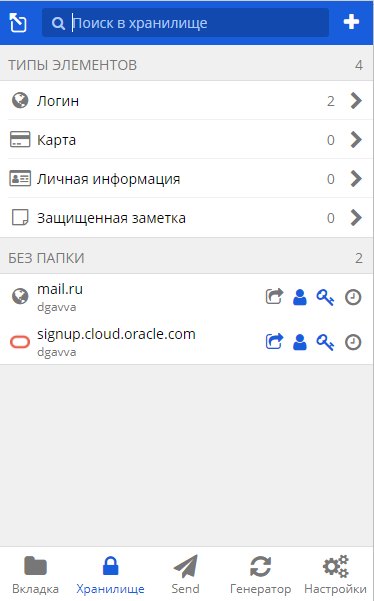
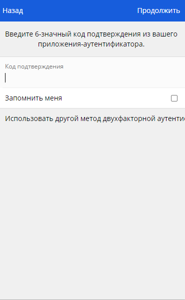
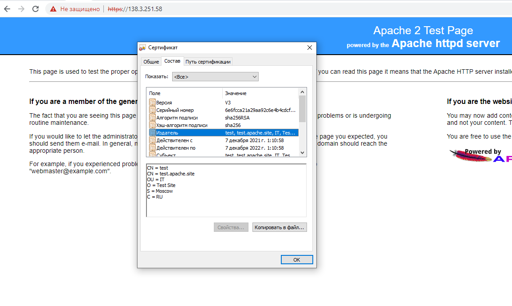
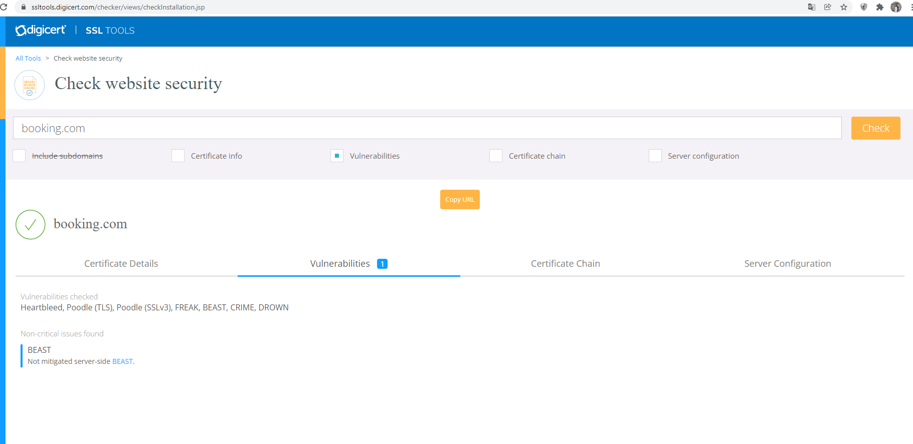
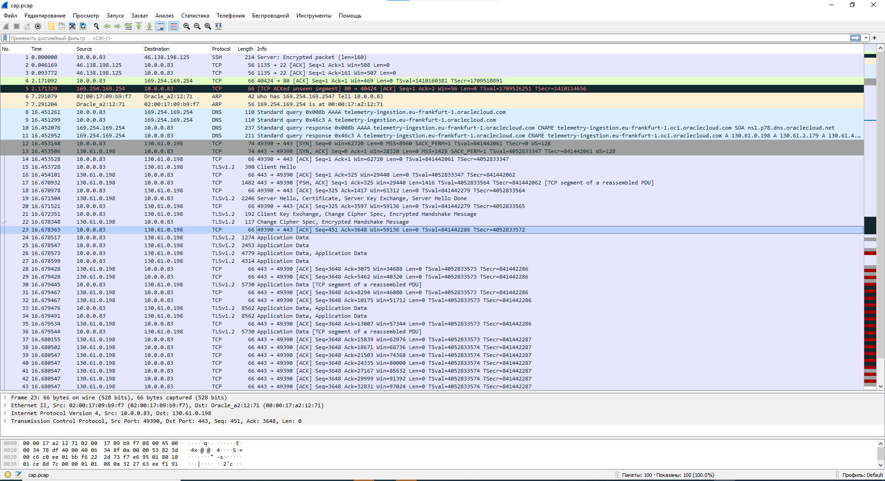

# Домашнее задание к занятию "3.9. Элементы безопасности информационных систем"

1. Установите Bitwarden плагин для браузера. Зарегестрируйтесь и сохраните несколько паролей.  
Готово

2. Установите Google authenticator на мобильный телефон. Настройте вход в Bitwarden акаунт через Google authenticator OTP.  
Готово


3. Установите apache2, сгенерируйте самоподписанный сертификат, настройте тестовый сайт для работы по HTTPS.

4. Проверьте на TLS уязвимости произвольный сайт в интернете.  
Внешнем сервисом:

Скриптом:
```bash
[opc@mylinuxbox testssl.sh]$ ./testssl.sh -U --sneaky https://www.booking.com

###########################################################
    testssl.sh       3.1dev from https://testssl.sh/dev/
    (0eb73d9 2021-12-07 08:55:54 -- )

      This program is free software. Distribution and
             modification under GPLv2 permitted.
      USAGE w/o ANY WARRANTY. USE IT AT YOUR OWN RISK!

       Please file bugs @ https://testssl.sh/bugs/

###########################################################

 Using "OpenSSL 1.0.2-chacha (1.0.2k-dev)" [~183 ciphers]
 on mylinuxbox:./bin/openssl.Linux.x86_64
 (built: "Jan 18 17:12:17 2019", platform: "linux-x86_64")


 Start 2021-12-07 08:42:41        -->> 37.10.0.220:443 (www.booking.com) <<--

 rDNS (37.10.0.220):     --
 Service detected:       HTTP


 Testing vulnerabilities

 Heartbleed (CVE-2014-0160)                not vulnerable (OK), no heartbeat ext                                                                                                                                                             ension
 CCS (CVE-2014-0224)                       not vulnerable (OK)
 Ticketbleed (CVE-2016-9244), experiment.  not vulnerable (OK)
 ROBOT                                     not vulnerable (OK)
 Secure Renegotiation (RFC 5746)           supported (OK)
 Secure Client-Initiated Renegotiation     not vulnerable (OK)
 CRIME, TLS (CVE-2012-4929)                not vulnerable (OK)
 BREACH (CVE-2013-3587)                    no gzip/deflate/compress/br HTTP compression (OK)  - only supplied "/" tested
 POODLE, SSL (CVE-2014-3566)               not vulnerable (OK)
 TLS_FALLBACK_SCSV (RFC 7507)              Downgrade attack prevention supported (OK)
 SWEET32 (CVE-2016-2183, CVE-2016-6329)    VULNERABLE, uses 64 bit block ciphers
 FREAK (CVE-2015-0204)                     not vulnerable (OK)
 DROWN (CVE-2016-0800, CVE-2016-0703)      not vulnerable on this host and port (OK)
                                           make sure you don't use this certificate elsewhere with SSLv2 enabled services
                                           https://censys.io/ipv4?q=FD07F4660C2CCF0E10BD0C9265E60A38A35ADD52A56ED4DBC61BD95B851C509A could help you to find out
 LOGJAM (CVE-2015-4000), experimental      not vulnerable (OK): no DH EXPORT ciphers, no DH key detected with <= TLS 1.2
 BEAST (CVE-2011-3389)                     TLS1: ECDHE-ECDSA-AES128-SHA
                                                 ECDHE-ECDSA-AES256-SHA
                                                 ECDHE-RSA-AES128-SHA
                                                 ECDHE-RSA-AES256-SHA
                                                 AES128-SHA AES256-SHA
                                                 DES-CBC3-SHA
                                           VULNERABLE -- but also supports higher protocols  TLSv1.1 TLSv1.2 (likely mitigated)
 LUCKY13 (CVE-2013-0169), experimental     potentially VULNERABLE, uses cipher block chaining (CBC) ciphers with TLS. Check patches
 Winshock (CVE-2014-6321), experimental    not vulnerable (OK)
 RC4 (CVE-2013-2566, CVE-2015-2808)        no RC4 ciphers detected (OK)


 Done 2021-12-07 08:43:13 [  39s] -->> 37.10.0.220:443 (www.booking.com) <<--


[opc@mylinuxbox testssl.sh]$
```

6. Установите на Ubuntu ssh сервер, сгенерируйте новый приватный ключ. Скопируйте свой публичный ключ на другой сервер. Подключитесь к серверу по SSH-ключу.
```bash
PS C:\Users\gavva\Downloads> ssh -i .\mykey.key dima@138.3.251.58

Last login: Mon Dec  6 22:35:57 2021 from 46.138.198.125
[dima@mylinuxbox ~]$
```
7. Переименуйте файлы ключей из задания 5. Настройте файл конфигурации SSH клиента, так чтобы вход на удаленный сервер осуществлялся по имени сервера.
```bash
dima@vagrant:~/.ssh$ ls -la
total 20
drwxrwxr-x 2 dima dima 4096 Dec  7 08:25 .
drwxr-xr-x 5 dima dima 4096 Dec  7 08:23 ..
-rw-rw-r-- 1 dima dima   84 Dec  7 08:25 config
-rwx------ 1 dima dima 1671 Dec  7 08:16 ida_rsa
-rw-r--r-- 1 dima dima  222 Dec  7 08:21 known_hosts
dima@vagrant:~/.ssh$ cat config
Host vpsbox
    Hostname 138.3.251.58
    User dima
    IdentityFile ~/.ssh/ida_rsa
dima@vagrant:~/.ssh$ ssh vpsbox
Activate the web console with: systemctl enable --now cockpit.socket

Last login: Tue Dec  7 08:25:50 2021 from 46.138.198.125
[dima@mylinuxbox ~]$
```

7. Соберите дамп трафика утилитой tcpdump в формате pcap, 100 пакетов. Откройте файл pcap в Wireshark.  
```bash
[opc@mylinuxbox ~]$ sudo tcpdump -c 100 -w cap.pcap
dropped privs to tcpdump
tcpdump: listening on ens3, link-type EN10MB (Ethernet), capture size 262144 bytes
100 packets captured
105 packets received by filter
0 packets dropped by kernel
```
